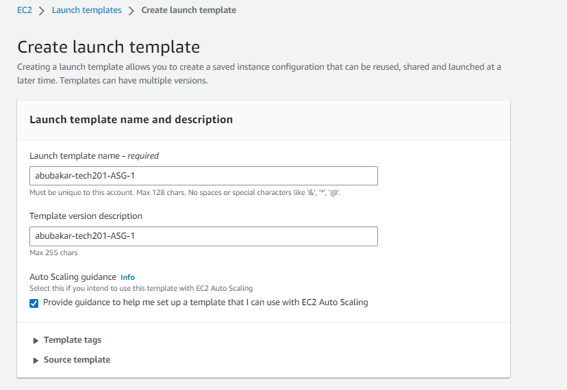
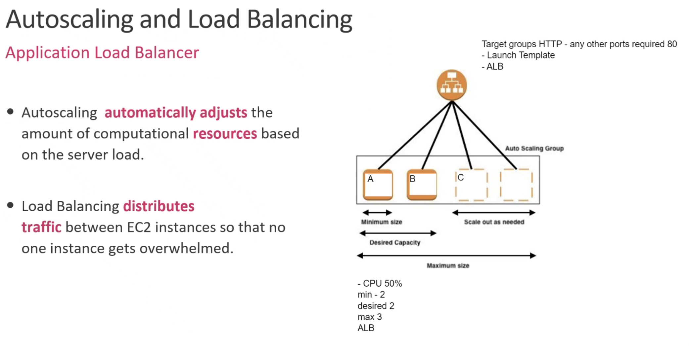

# cloud_computing_aws
cloud_computing_aws

# What is cloud computing?

Cloud computing is a technology that enables users to access computing resources, such as storage, processing power, and software applications, over the internet, without needing to own or maintain the physical infrastructure that supports these resources. In other words, cloud computing allows individuals and organizations to use shared, on-demand computing resources that are housed in data centers and managed by cloud service providers. This can provide many benefits, such as flexibility, scalability, cost savings, and increased security. Cloud computing is used for a variety of applications, including data storage, software development, machine learning, and artificial intelligence, among others.

# What are the benefits of Cloud computing? / What are the benefits of Cloud computing for businesses?

Cloud computing offers many benefits to individuals and organizations, including:

1. Reliability: Cloud service providers typically offer high levels of uptime and reliability, so users can rely on their services to be available when they need them.

2. Access to new technology: Cloud providers often offer the latest technology and software, which can help users stay competitive and up-to-date with the latest industry trends.

3. Cost savings: Businesses can save money by avoiding the upfront capital expenditures associated with purchasing and maintaining their own hardware and software. With cloud computing, they can pay for what they use on a subscription or pay-per-use basis, which can help them to better manage their budgets.

4. Scalability: Cloud computing makes it easy for businesses to scale up or down their computing resources as their needs change. This allows them to respond quickly to changing market conditions or unexpected increases in demand.

5. Flexibility: Cloud computing provides businesses with the flexibility to access their data and applications from anywhere, using any device. This enables employees to work remotely or from different locations, which can help businesses to attract and retain top talent.

6. Collaboration: Cloud computing makes it easy for teams to collaborate on projects, regardless of their location. With cloud-based applications and storage, teams can access the same data and applications in real-time, which can lead to increased productivity and better decision-making.

7. Business continuity: Cloud computing providers often have robust disaster recovery and business continuity measures in place, which can help businesses to quickly recover from unforeseen events such as natural disasters or cyberattacks.

8. Security: Cloud computing providers often have dedicated security teams and advanced security technologies in place to protect against cyber threats, which can be more effective and efficient than what a business/ individual could implement on its own.

9. Innovation: Cloud computing can provide access to new technologies, such as machine learning, artificial intelligence, and big data analytics, which can help them to gain a competitive advantage and improve their operations.

Overall, cloud computing can help users be more efficient, productive, and agile in their operations, while also providing cost savings and increased security and cloud computing can provide businesses with greater agility, flexibility, and cost savings, while also providing access to advanced technologies and increased security.

# What is AWS?

# History of AWS

# Who are some of the other leaders in Cloud technology?

There are many companies that are leaders in cloud technology, but some of the most prominent ones include:

1. Amazon Web Services (AWS): AWS is a subsidiary of Amazon that provides a wide range of cloud computing services, including computing, storage, databases, analytics, and machine learning.

2. Microsoft Azure: Azure is a cloud computing service offered by Microsoft that provides a range of services, including computing, storage, analytics, and machine learning.

3. Google Cloud Platform: Google Cloud Platform is a suite of cloud computing services offered by Google, including computing, storage, analytics, and machine learning.

4. IBM Cloud: IBM Cloud is a suite of cloud computing services offered by IBM, including computing, storage, databases, and machine learning.

5. Oracle Cloud: Oracle Cloud is a suite of cloud computing services offered by Oracle, including computing, storage, databases, and applications.

6. Salesforce: Salesforce is a cloud-based customer relationship management (CRM) platform that provides a wide range of tools for sales, marketing, and customer service.

7. VMware: VMware provides virtualization and cloud computing software and services, including infrastructure as a service (IaaS) and platform as a service (PaaS).

These companies are leaders in the cloud computing industry due to their extensive offerings of cloud computing services, widespread adoption by businesses, and ongoing investments in innovation and research.

# What are the different types of cloud (public, private, hybrid) / What types of industry use each type of cloud? and Why?

The different types of cloud can be broadly divided into three categories: public cloud, private cloud, and hybrid cloud. 

Public cloud: A public cloud is a cloud computing service that is made available to the general public over the internet. It is owned and operated by a third-party cloud service provider, and is hosted on their infrastructure. Public clouds are generally the most cost-effective option for businesses, as they allow for the sharing of resources and costs among multiple users. Examples of public cloud services include Amazon Web Services (AWS), Microsoft Azure, and Google Cloud Platform.

Private cloud: A private cloud is a cloud computing service that is hosted on a private network. It is owned and operated by a single organization, and is typically hosted on their own servers or data centers. Private clouds provide organizations with greater control and security over their data and applications, as they are not shared with other users. Examples of private cloud services include VMware vCloud, Microsoft Azure Stack, and OpenStack.

Hybrid cloud: A hybrid cloud is a cloud computing service that combines elements of both public and private clouds. It allows organizations to use both public and private cloud services, depending on their specific needs. Hybrid clouds provide organizations with the flexibility to use the best of both worlds, allowing them to take advantage of the cost savings of public clouds while still maintaining control and security of their data and applications. Examples of hybrid cloud services include Microsoft Azure Stack, IBM Cloud Private, and Oracle Cloud Infrastructure.

# What are the different types of Cloud service? (IaaS, Paas, Saas), Differences between them

There are three main types of cloud services: Infrastructure as a Service (IaaS), Platform as a Service (PaaS), and Software as a Service (SaaS).

1. Infrastructure as a Service (IaaS): IaaS provides users with virtualized computing resources, such as servers, storage, and networking, on a pay-per-use basis. IaaS users typically have more control over their infrastructure than with PaaS or SaaS, allowing them to install and manage their own operating systems, applications, and middleware.

2. Platform as a Service (PaaS): PaaS provides users with a complete development and deployment platform, including operating systems, programming languages, libraries, and tools. PaaS users do not have to worry about managing the underlying infrastructure, as it is taken care of by the cloud provider. This allows developers to focus on building and deploying applications, rather than managing infrastructure.

3. Software as a Service (SaaS): SaaS provides users with access to software applications that are hosted and managed by the cloud provider. Users do not have to install or maintain the software themselves, and can access it through a web browser or mobile app. SaaS applications are typically multi-tenant, meaning that many users can access the same application at the same time.

The main differences between IaaS, PaaS, and SaaS are the level of control and responsibility that users have over the underlying infrastructure and applications. IaaS provides the most control, while SaaS provides the least. PaaS falls somewhere in between, as it allows users to focus on application development and deployment, while still providing some control over the underlying infrastructure. Additionally, the pricing models for each type of service are typically different, with IaaS being more pay-as-you-go and usage-based, while PaaS and SaaS are typically subscription-based.

# Operating expenditure vs Capital expenditure (OpEx vs CapEx)

Operating expenditure (OpEx) and capital expenditure (CapEx) are two different types of expenses that businesses incur.

1. Operating expenditure (OpEx): OpEx refers to the ongoing, day-to-day expenses that a business incurs in order to keep its operations running. This includes expenses such as salaries and wages, rent, utilities, supplies, and maintenance. OpEx expenses are typically fully tax-deductible in the year they are incurred, and are recorded as an expense on the income statement.

2. Capital expenditure (CapEx): CapEx refers to the expenses that a business incurs in order to acquire or improve a long-term asset, such as property, equipment, or software. These expenses are not fully tax-deductible in the year they are incurred, but are typically depreciated over a period of several years. CapEx expenses are recorded as an asset on the balance sheet, and are gradually expensed over time as the asset is used.

The main differences between OpEx and CapEx are:

1. Timeframe: OpEx is incurred in the short-term, usually on a day-to-day or monthly basis, while CapEx is incurred for long-term assets that are expected to provide value to the business over a period of several years.

2. Tax treatment: OpEx expenses are usually fully tax-deductible in the year they are incurred, while CapEx expenses are typically depreciated over a period of several years, which may result in a slower tax deduction.

3. Accounting treatment: OpEx expenses are recorded as expenses on the income statement, while CapEx expenses are recorded as assets on the balance sheet and are gradually expensed over time.

Overall, businesses need to carefully manage both OpEx and CapEx to ensure that they are spending their money effectively and efficiently, while also balancing short-term expenses with long-term investments in their business.

# Examples of companies that use the cloud - and what for

# Migrating our app to the host

## Running nginx on aws

We want to start by signing in to our AWS account and making our way to EC2's dashboard

Now we want to launch an EC2 and adjust the setting to our needs:

1. Make sure to name your file, so you can identify the instance created
2. We want to make sure we are using the right os and for us that is : `Ubuntu Server 18.04 LTS (HVM), SSD Volume Typeami-02f0341ac93c96375 (64-bit (x86)) / ami-0762687a8d9956f0f (64-bit (Arm))` 
3. Next we need to use a keypair in order to be allowed ssh access to the instance. (This was given to us by Sharukh)
4. The next stage is that we need to change the network settings so that we have a security group and VPC selected. We decided to create security groups and the rules 

These are the inbound rules we have applied.

5. Now that are instance is running we need to we need to connect with it via ssh, first we need to change the read/write rules on our key buy inputting `chmod 400 devops-tech201.pem`
6. Now in git bash we can connect to our instance by using `ssh -i "devops-tech201.pem" ubuntu@ec2-34-242-189-225.eu-west-1.compute.amazonaws.com`
7. Now when we search our public IP we should be welcomed to Nginx you can get this on EC2 instance connect

8. Finally, you should be welcomed to nginx:

# Installing our app

Now to install our app we need to first get the app file into our ssh which can be done with the command `scp -i devops-tech201.pem -r <your app path> ubuntu@<your IP in the example block you paste to ssh into ec2>:/home/ubuntu`

and this will allow you to now have your app folder inside your ec2

