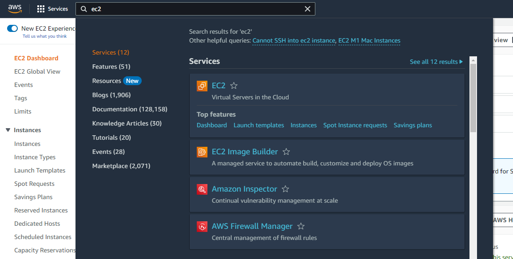
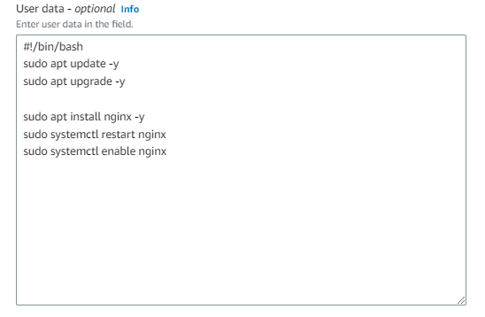
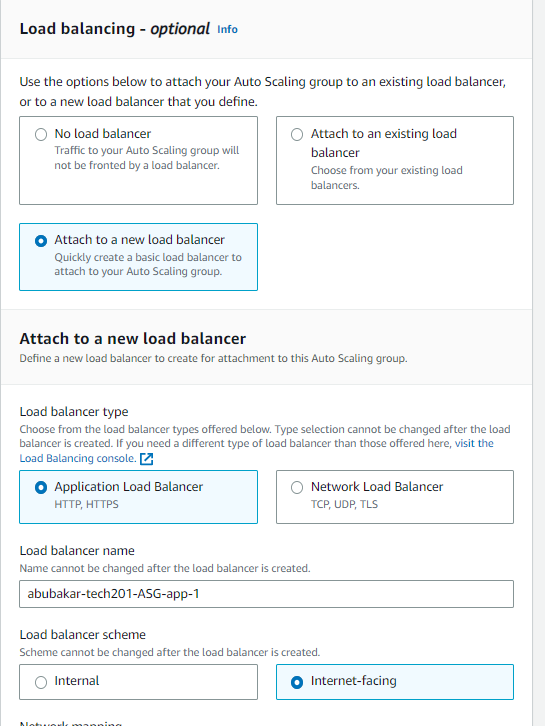
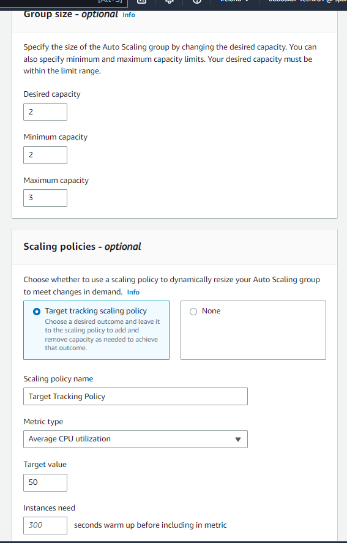

# cloud_computing_aws
cloud_computing_aws

# What is cloud computing?

Cloud computing is a technology that enables users to access computing resources, such as storage, processing power, and software applications, over the internet, without needing to own or maintain the physical infrastructure that supports these resources. In other words, cloud computing allows individuals and organizations to use shared, on-demand computing resources that are housed in data centers and managed by cloud service providers. This can provide many benefits, such as flexibility, scalability, cost savings, and increased security. Cloud computing is used for a variety of applications, including data storage, software development, machine learning, and artificial intelligence, among others.

# What are the benefits of Cloud computing? / What are the benefits of Cloud computing for businesses?

Cloud computing offers many benefits to individuals and organizations, including:

1. Reliability: Cloud service providers typically offer high levels of uptime and reliability, so users can rely on their services to be available when they need them.

2. Access to new technology: Cloud providers often offer the latest technology and software, which can help users stay competitive and up-to-date with the latest industry trends.

3. Cost savings: Businesses can save money by avoiding the upfront capital expenditures associated with purchasing and maintaining their own hardware and software. With cloud computing, they can pay for what they use on a subscription or pay-per-use basis, which can help them to better manage their budgets.

4. Scalability: Cloud computing makes it easy for businesses to scale up or down their computing resources as their needs change. This allows them to respond quickly to changing market conditions or unexpected increases in demand.

5. Flexibility: Cloud computing provides businesses with the flexibility to access their data and applications from anywhere, using any device. This enables employees to work remotely or from different locations, which can help businesses to attract and retain top talent.

6. Collaboration: Cloud computing makes it easy for teams to collaborate on projects, regardless of their location. With cloud-based applications and storage, teams can access the same data and applications in real-time, which can lead to increased productivity and better decision-making.

7. Business continuity: Cloud computing providers often have robust disaster recovery and business continuity measures in place, which can help businesses to quickly recover from unforeseen events such as natural disasters or cyberattacks.

8. Security: Cloud computing providers often have dedicated security teams and advanced security technologies in place to protect against cyber threats, which can be more effective and efficient than what a business/ individual could implement on its own.

9. Innovation: Cloud computing can provide access to new technologies, such as machine learning, artificial intelligence, and big data analytics, which can help them to gain a competitive advantage and improve their operations.

Overall, cloud computing can help users be more efficient, productive, and agile in their operations, while also providing cost savings and increased security and cloud computing can provide businesses with greater agility, flexibility, and cost savings, while also providing access to advanced technologies and increased security.

# What is AWS?

# History of AWS

# Who are some of the other leaders in Cloud technology?

There are many companies that are leaders in cloud technology, but some of the most prominent ones include:

1. Amazon Web Services (AWS): AWS is a subsidiary of Amazon that provides a wide range of cloud computing services, including computing, storage, databases, analytics, and machine learning.

2. Microsoft Azure: Azure is a cloud computing service offered by Microsoft that provides a range of services, including computing, storage, analytics, and machine learning.

3. Google Cloud Platform: Google Cloud Platform is a suite of cloud computing services offered by Google, including computing, storage, analytics, and machine learning.

4. IBM Cloud: IBM Cloud is a suite of cloud computing services offered by IBM, including computing, storage, databases, and machine learning.

5. Oracle Cloud: Oracle Cloud is a suite of cloud computing services offered by Oracle, including computing, storage, databases, and applications.

6. Salesforce: Salesforce is a cloud-based customer relationship management (CRM) platform that provides a wide range of tools for sales, marketing, and customer service.

7. VMware: VMware provides virtualization and cloud computing software and services, including infrastructure as a service (IaaS) and platform as a service (PaaS).

These companies are leaders in the cloud computing industry due to their extensive offerings of cloud computing services, widespread adoption by businesses, and ongoing investments in innovation and research.

# What are the different types of cloud (public, private, hybrid) / What types of industry use each type of cloud? and Why?

The different types of cloud can be broadly divided into three categories: public cloud, private cloud, and hybrid cloud. 

Public cloud: A public cloud is a cloud computing service that is made available to the general public over the internet. It is owned and operated by a third-party cloud service provider, and is hosted on their infrastructure. Public clouds are generally the most cost-effective option for businesses, as they allow for the sharing of resources and costs among multiple users. Examples of public cloud services include Amazon Web Services (AWS), Microsoft Azure, and Google Cloud Platform.

Private cloud: A private cloud is a cloud computing service that is hosted on a private network. It is owned and operated by a single organization, and is typically hosted on their own servers or data centers. Private clouds provide organizations with greater control and security over their data and applications, as they are not shared with other users. Examples of private cloud services include VMware vCloud, Microsoft Azure Stack, and OpenStack.

Hybrid cloud: A hybrid cloud is a cloud computing service that combines elements of both public and private clouds. It allows organizations to use both public and private cloud services, depending on their specific needs. Hybrid clouds provide organizations with the flexibility to use the best of both worlds, allowing them to take advantage of the cost savings of public clouds while still maintaining control and security of their data and applications. Examples of hybrid cloud services include Microsoft Azure Stack, IBM Cloud Private, and Oracle Cloud Infrastructure.


# What are the different types of Cloud service? (IaaS, Paas, Saas), Differences between them

There are three main types of cloud services: Infrastructure as a Service (IaaS), Platform as a Service (PaaS), and Software as a Service (SaaS).

1. Infrastructure as a Service (IaaS): IaaS provides users with virtualized computing resources, such as servers, storage, and networking, on a pay-per-use basis. IaaS users typically have more control over their infrastructure than with PaaS or SaaS, allowing them to install and manage their own operating systems, applications, and middleware.

2. Platform as a Service (PaaS): PaaS provides users with a complete development and deployment platform, including operating systems, programming languages, libraries, and tools. PaaS users do not have to worry about managing the underlying infrastructure, as it is taken care of by the cloud provider. This allows developers to focus on building and deploying applications, rather than managing infrastructure.

3. Software as a Service (SaaS): SaaS provides users with access to software applications that are hosted and managed by the cloud provider. Users do not have to install or maintain the software themselves, and can access it through a web browser or mobile app. SaaS applications are typically multi-tenant, meaning that many users can access the same application at the same time.

The main differences between IaaS, PaaS, and SaaS are the level of control and responsibility that users have over the underlying infrastructure and applications. IaaS provides the most control, while SaaS provides the least. PaaS falls somewhere in between, as it allows users to focus on application development and deployment, while still providing some control over the underlying infrastructure. Additionally, the pricing models for each type of service are typically different, with IaaS being more pay-as-you-go and usage-based, while PaaS and SaaS are typically subscription-based.

# Operating expenditure vs Capital expenditure (OpEx vs CapEx)

Operating expenditure (OpEx) and capital expenditure (CapEx) are two different types of expenses that businesses incur.

1. Operating expenditure (OpEx): OpEx refers to the ongoing, day-to-day expenses that a business incurs in order to keep its operations running. This includes expenses such as salaries and wages, rent, utilities, supplies, and maintenance. OpEx expenses are typically fully tax-deductible in the year they are incurred, and are recorded as an expense on the income statement.

2. Capital expenditure (CapEx): CapEx refers to the expenses that a business incurs in order to acquire or improve a long-term asset, such as property, equipment, or software. These expenses are not fully tax-deductible in the year they are incurred, but are typically depreciated over a period of several years. CapEx expenses are recorded as an asset on the balance sheet, and are gradually expensed over time as the asset is used.

The main differences between OpEx and CapEx are:

1. Timeframe: OpEx is incurred in the short-term, usually on a day-to-day or monthly basis, while CapEx is incurred for long-term assets that are expected to provide value to the business over a period of several years.

2. Tax treatment: OpEx expenses are usually fully tax-deductible in the year they are incurred, while CapEx expenses are typically depreciated over a period of several years, which may result in a slower tax deduction.

3. Accounting treatment: OpEx expenses are recorded as expenses on the income statement, while CapEx expenses are recorded as assets on the balance sheet and are gradually expensed over time.

Overall, businesses need to carefully manage both OpEx and CapEx to ensure that they are spending their money effectively and efficiently, while also balancing short-term expenses with long-term investments in their business.

# Examples of companies that use the cloud - and what for


# Migrating our app to the host


## Running nginx on aws

We want to start by signing in to our AWS account and making our way to EC2's dashboard



Now we want to launch an EC2 and adjust the setting to our needs:


1. Make sure to name your file, so you can identify the instance created
2. We want to make sure we are using the right os and for us that is : `Ubuntu Server 18.04 LTS (HVM), SSD Volume Typeami-02f0341ac93c96375 (64-bit (x86)) / ami-0762687a8d9956f0f (64-bit (Arm))` 
3. Next we need to use a keypair in order to be allowed ssh access to the instance. (This was given to us by Sharukh)
4. The next stage is that we need to change the network settings so that we have a security group and VPC selected. We decided to create security groups and the rules 


These are the inbound rules we have applied.


5. Now that are instance is running we need to we need to connect with it via ssh, first we need to change the read/write rules on our key buy inputting `chmod 400 devops-tech201.pem`
6. Now in git bash we can connect to our instance by using `ssh -i "devops-tech201.pem" ubuntu@ec2-34-242-189-225.eu-west-1.compute.amazonaws.com`
7. Now when we search our public IP we should be welcomed to Nginx you can get this on EC2 instance connect


8. Finally, you should be welcomed to nginx:


# Installing our app

Now to install our app we need to first get the app file into our ssh which can be done with the command `scp -i devops-tech201.pem -r <your app path> ubuntu@<your IP in the example block you paste to ssh into ec2>:/home/ubuntu`

and this will allow you to now have your app folder inside your ec2

# SSH
Using key pairs to SSH involves generating a public and private key on your local machine, and then adding the public key to the remote server. Here are some key points to keep in mind when using key pairs to SSH:

- Key pairs provide a more secure method of authentication than traditional password-based authentication.
- When connecting to the remote server, specify the private key file with the -i option, for example: ssh -i ~/.ssh/id_rsa user@server.

- It's important to keep the private key file secure and not share it with others.

- Key pairs can be used with SSH agents.

In summary, using key pairs to SSH provides a more secure method of authentication and involves generating a key pair on your local machine, adding the public key to the remote server, and specifying the private key file when connecting. It's important to keep the private key file secure and consider using an SSH agent to avoid having to enter passwords multiple times.

# Creating a 2-tier architecture


## Why do we need to make a 2-tier architecture ?

A two-tier architecture, also known as client-server architecture, is a way to divide an application into two parts: a client that provides a user interface and a server that performs the data processing. This architecture provides several benefits, such as increased scalability, improved performance, and better security.

## Why do we need to refactor a monolithic architecture into a 2-tier?

A monolithic architecture is a type of architecture in which an entire application is built as a single unit. This can make the application difficult to maintain, scale, and deploy. Refactoring a monolithic architecture into a 2-tier architecture can help solve these problems by dividing the application into two parts: a front-end client and a back-end server.

## Why did we do it on the cloud?

The cloud offers several advantages for a 2-tier architecture, including scalability, reliability, and cost-effectiveness. By leveraging cloud services, it's possible to easily scale up or down depending on the demand for the application, ensure high availability, and reduce infrastructure costs.

## How does this fit into DevOps?

DevOps is an approach that emphasizes collaboration and communication between development and operations teams. A 2-tier architecture can help facilitate DevOps practices by separating concerns between the front-end and back-end, allowing teams to work independently and deploy changes faster. By using cloud services, it's also possible to automate deployment and infrastructure management, which can further streamline DevOps processes.

## How does this fit into agile/ SCRUM?

Agile and Scrum are methodologies that emphasize iterative development, continuous delivery, and collaboration between team members. A 2-tier architecture can help support these methodologies by providing a scalable architecture that allows teams to work independently and deliver changes quickly. By using cloud services, it's also possible to leverage the benefits of agile and Scrum by automating deployment and testing, ensuring fast feedback loops and continuous integration.


# Requirements
- App tier deployed - available on public IP
- Create 2nd tier database on ec2 with required dependencies: Ubuntu 18.04, mongodob installed, change mongod.conf 0.0.0.0.
- Need a security group for our database - allow 27017 from anywhere - allow only from app instance
- Go back to the app and create an environment variable with the database endpoint
- Relaunch the app
- Securing architecture with security groups
- App is exposed to the world, database is exposed only to app, limiting access to database

## Migrating our database to the host 

We began by creating a new EC2 instance in the same way and naming it as the database. The only thing we had to make sure to do is change the inbound rules so that it's not accessible on port 80 / port 3000 byr rather on port 27017 which we get from our mongodb and also making sure to name our new security group with db-sg, so we can find it later on.


After using the same method to ssh into our virtual machine, the first thing we need to do is update/upgarde with `sudo apt-get update -y` `sudo apt-get upgrade -y`. This time instead of using the `scp` command we decided to clone into our database file by using `git clone` and now all we had to do is run our provision.sc. However, we need to make sure to comment out  anything that was not needed. 

```
#!/bin/bash

# key installation
sudo apt-key adv --keyserver hkp://keyserver.ubuntu.com:80 --recv D68FA50FEA312927
echo "deb https://repo.mongodb.org/apt/ubuntu xenial/mongodb-org/3.2 multiverse" | sudo tee /etc/apt/sources.list.d/mongodb-org-3.2.list

# update and upgrade
sudo apt-get update -y
sudo apt-get upgrade -y

# install the db
#sudo apt-get install mongodb-org=3.2.20 -y
sudo apt-get install -y mongodb-org=3.2.20 mongodb-org-server=3.2.20 mongodb-org-shell=3.2.20 mongodb-org-mongos=3.2.20 mongodb-org-tools=3.2.20

# start and enable database
#sudo systemctl start mongod
#sudo systemctl enable mongod

# changing the ip
#sudo rm /etc/mongod.conf
#sudo cp environment/database/mongod.conf /etc/mongod.conf

# start and enable database
sudo systemctl restart mongod
sudo systemctl enable mongod


```
Now all we need to do is check if mongod is active by using the command `sudo systemctl status mongod` and if everything is okay you will end up with this returned:


Now one last thing we want to do is edit the configurations in our `mongod.conf` and you can find this in your `/etc` folder. The configuration want to change is that of the bindIP, and we want to make this 0.0.0.0 :

```
# mongod.conf

#   http://docs.mongodb.org/manual/reference/configuration-options/

# Where and how to store data.
storage:
  dbPath: /var/lib/mongodb
  journal:
    enabled: true
#  engine:
#  mmapv1:
#  wiredTiger:

# where to write logging data.
systemLog:
  destination: file
  logAppend: true
  path: /var/log/mongodb/mongod.log

# network interfaces
net:
  port: 27017
  bindIp: 0.0.0.0


#processManagement:

#security:

#operationProfiling:

#replication:

#sharding:

## Enterprise-Only Options:

#auditLog:

#snmp:
```

## Connecting our app to our database

This can be done by creating an environmental variable in our app instance. What we need to do is ssh back into our app instance and use `export DB_HOST=mongodb://<database ip>:27017/posts`

What we now need to do is seed our database with `node seeds/seed.js` and when we start `node app.js` we should be able to see that when we search `appIP:3000/posts` we can now see how our database and app are linked.

## Creating an Ami

1. ssh into your app virtual machine
2. Navigate to the directory with app.js and launch the app:
node app.js (the app must be launched because you want to make an image of your machine in a running state, because that's how it will be saved)
3. Select the app instance on AWS and from the actions drop down menu, select image and templates -> Create image
4. Specify the image name following your naming convention, e.g. name-group-ve-ami
5. In the description, use the same naming convention but also add what ports can connect to the instance, so that when you come back to the image further down the line you know how to use it, e.g : `name-group-ve-ami-port1-port2-port3-etc`
6. Create the instance
7. To find your instance from the AWS home page, search EC2 and click on it
8. On the left-hand side, under Images, click AMIs
9. Find your image by typing in your instance name
10. Select the image and click Launch instance from AMI
11. Name the instance appropriately `name-group-db-ami`
12. Enter your key
13. Select an existing security group, and choose your old db security group from the list
- This step is why it is useful to name your security groups, as know you know what ports can be used
14. Launch the instance
15. From here, your instance should be initiated, with the same dependencies as when the image was created
16. To relaunch your 2 tier architecture, simply update the environmental variable in your app ve to have the ip of the new db, and from there the steps are the same:
17. Seed the database in the app directory using `node seeds/seed.js`
18. Launch the app using `node app.js`


## Setting a cloudWatch alarm

You need to start by first enabling monitoring on your instance witch can be found using the sub heading once checking the instance then follow the guide:

https://docs.aws.amazon.com/AmazonCloudWatch/latest/monitoring/US_AlarmAtThresholdEC2.html

## Note to self 

MAKE SURE CONFIGURATION FILES ARE CORRECT

There are two different curl commands when provisioning app, and you need to make suer to use the right one for yourself

```
curl -sL https://deb.nodesource.com/setup_12.x | sudo -E bash - # This is the correct one i should have been using 

curl -sL https://deb.nodesource.com/setup_6.x # This is version 6 and it did not work with my app provisioning

```


Had a versioning problem that did not allow me to `npm install` so i should go straight into `node app.js`

To add execute permissions to your provision.sh `chmod +x provision.sh`

To run a script `./filename`. Make sure there is `#!/bin/bash` inside the top of the file

To check what's inside a file to make sure the correct changes are saved use `cat <filename>`

# S3 Simple Storage Service

## What is S3?

S3 (Simple Storage Service) is a cloud-based storage service provided by Amazon Web Services (AWS). It allows users to store and retrieve any amount of data, at any time, from anywhere on the web. S3 is designed to provide high durability, availability, and scalability for storing and retrieving large volumes of data.

With S3, users can create buckets to store objects, such as files or other data, in a highly available and secure manner. The service is designed to provide unlimited storage capacity, with files ranging in size from a few bytes to several terabytes.

S3 also offers a number of features and tools for managing data, including versioning, access control, encryption, lifecycle policies, and event notifications. It can be used as a standalone storage service or in combination with other AWS services, such as EC2 (Elastic Compute Cloud) for computing and processing, or Lambda for serverless computing.

S3 is widely used by businesses and organizations of all sizes for storing and retrieving a wide variety of data, including media content, backups, archives, logs, and big data sets.

## Why should we use S3? (Benefits of S3)

There are several reasons why you may want to use S3 for storing and managing your data:

1. Scalability: S3 can store an unlimited amount of data, making it a good choice for businesses that need to store large amounts of data that may grow over time. It's also designed to handle sudden spikes in traffic and usage, so you can be confident that your data will be available when you need it.

2. Durability and availability: S3 is designed to provide high durability and availability for storing and retrieving data. It automatically replicates data across multiple availability zones, so you can be sure that your data is safe even if there is a failure in one of the zones.

3. Cost-effective: S3 offers a flexible pricing model, with no upfront costs or minimum fees. You pay only for what you use, and the cost is based on the amount of data stored, data transferred, and other factors.

4. Security: S3 offers a range of security features to protect your data, including encryption at rest and in transit, access control, and audit logs. You can also use AWS Identity and Access Management (IAM) to manage access to your S3 resources.

5. Integration with other AWS services: S3 integrates with a range of other AWS services, such as EC2, Lambda, and CloudFront, making it easy to build scalable, robust applications.

6. Developer-friendly: S3 provides a range of tools and APIs for developers to integrate S3 into their applications. You can also use the AWS Management Console to manage your S3 resources.

Overall, S3 is a powerful and flexible storage service that can help you store, manage, and retrieve your data securely and cost-effectively.

## Disaster Recovery

S3 (Simple Storage Service) provides several options for disaster recovery to help you protect your data in the event of a disaster or outage. Here are some of the key features and options that S3 provides for disaster recovery:

1. Replication: S3 allows you to replicate your data to other AWS regions or within the same region to ensure that your data is available in multiple locations. You can use S3 Cross-Region Replication to replicate your data to a different region, or you can use S3 Same-Region Replication to replicate your data to different availability zones within the same region.

2. Versioning: S3 provides versioning, which allows you to store multiple versions of an object in the same bucket. This can help protect against data loss or corruption, as you can restore a previous version of the object if the current version is lost or corrupted.

3. Lifecycle policies: S3 allows you to create lifecycle policies to automatically transition objects to other storage classes or delete them after a certain period of time. This can help you manage your storage costs and ensure that your data is stored according to your business needs.

4. Access controls: S3 provides several options for controlling access to your data, including bucket policies and access control lists (ACLs). You can use these features to ensure that only authorized users or applications have access to your data.

5. AWS Disaster Recovery: AWS provides a Disaster Recovery solution called AWS Disaster Recovery (DR) service that includes pre-configured AWS services and features such as AWS CloudFormation, AWS Lambda, Amazon SNS and more. Using these services, you can automate your disaster recovery solution and minimize your recovery time.

By using these features and options, you can create a robust disaster recovery strategy for your S3 data and help ensure that your data is available and protected in the event of a disaster or outage.

## Best use cases of S3 

Here are some of the best use cases for S3:

1. Data backup and archival: S3 is an ideal solution for backing up and archiving data. It provides high durability and availability, as well as flexible storage classes that allow you to optimize your storage costs.

2. Web and mobile applications: S3 can be used to store and deliver static and dynamic content for web and mobile applications, including images, videos, and user-generated content. S3 can also be integrated with other AWS services, such as Amazon CloudFront, to deliver content to end-users with low latency and high performance.

3. Big data and analytics: S3 can be used as a storage layer for big data and analytics workloads. It provides a scalable, durable, and secure storage solution for data processing frameworks such as Apache Hadoop, Apache Spark, and Amazon EMR.

4. Disaster recovery and business continuity: S3 provides replication options that can be used to replicate data across multiple regions or within the same region to ensure that your data is available in the event of a disaster. S3 can also be used as a storage layer for backup and disaster recovery solutions.

5. Media and entertainment: S3 can be used to store and deliver media content, such as video and audio files, for media and entertainment companies. S3 provides high durability and availability, and can be integrated with other AWS services to provide a complete media solution.

Overall, S3 is a flexible and scalable storage solution that can be used for a wide range of use cases. It provides high durability, availability, and security, and can be integrated with other AWS services to provide a complete solution for your storage and data management needs.

## CRUD

CRUD is an acronym that stands for Create, Read, Update, and Delete. These are the basic operations that can be performed on data in a storage system, including cloud-based storage services like S3 (Simple Storage Service). In addition to these operations, S3 also provides upload and download operations that allow you to transfer data to and from your S3 bucket.

Here is a brief overview of each of these operations in the context of S3:

1. Create: To create a new object in S3, you can upload a file or use the S3 API to create an empty object. When you create a new object, you specify the object's key (i.e., the unique identifier for the object) and any metadata associated with the object.

2. Read: To read an object from S3, you can use the S3 API or the AWS Management Console to retrieve the object's content and metadata. You can also use pre-signed URLs to provide temporary access to the object for a specific user or application.

3. Update: To update an object in S3, you can overwrite the object with a new version, or use the S3 API to update the object's metadata. You can also use versioning to maintain multiple versions of an object, and lifecycle policies to automatically transition objects to other storage classes or delete them after a certain period of time.

4. Delete: To delete an object from S3, you can use the S3 API or the AWS Management Console to delete the object. When you delete an object, it is permanently removed from S3 and cannot be recovered.

5. Upload: To upload data to S3, you can use the S3 API or the AWS Management Console to upload files or folders to your S3 bucket. You can also use multipart uploads to upload large files in parallel and resume failed uploads.

6. Download: To download data from S3, you can use the S3 API or the AWS Management Console to download files or folders from your S3 bucket. You can also use pre-signed URLs to provide temporary access to the object for a specific user or application.

Overall, these operations provide a comprehensive set of features for managing data in S3, including uploading and downloading data, creating, reading, updating, and deleting objects.

## Creating a S3 bucket 


1. First, we must create an instance in ec2 so that we may enter aws in cli (command line interface): the steps for theis is above ^ just make sure to allow access to port 22 and port 80.

2. Next once ssh into our new s3 instance we need to make sure we have our secret access keys in a secure location such as our .ssh folder. Remember to update and upgrade before doing anything
```
sudo apt update -y
sudo apt upgrade -y
```
3. We now need to install python/ aws cli
```
sudo apt install python -y
# python --version # if this is not version 3 we have to get it upto date

alias python=python3 # should make this a persistant varible later on
# python --version

sudo apt install python3-pip
sudo pip3 install awscli
```
4. The next step is to configure our aws cli by entering the access keys
```
aws configure

#1. enter acces keys
#2. enter sceret keys
#3. select region <eu-west-1>
#4. select format <JSON>
```

5. now we can check if we have access with:
```
aws s3 ls
```
6. We can now create a buck it s3:
```
aws s3 mb s3://<bucket-name> # Name needs to use "-" rather than "_" because s3 uses _ so we nee to refrain from using them
```
7. Now to copy a file into our bucket:
```
aws s3 cp <filename> s3://<bucketname> # if file is somewhere eles you mus provide absolute path
```
This is what the s3 bucket looks like with the file inside:


8. The next step is to allow permissions, if this is not done you will receive an error message:


In the permission subheading we need to allow access so people can read this file (if you have sensitive data be careful on whom you give permission) - this is the equivalent to chmod 700:


9. Now when you click on the url of the object you should be able to read the file in a browser

10. Copying from s3 into cli `aws s3 cp s3://<bucketname>/<s3 file name> <new_file_name>` or `aws s3 sync s3://<bucketname>.` # the '.' is for current directory 

11. Removing an s3 bucket:
```
aws s3 rb  s3://<bucketname>

# You need to first remove all items from the bucket before you do this 

aws s3 rm s3://<bucketname> --recursive

# You can also use the flag --f but this is dangerous as it doesn't send a warning for sensitive data before deleting everything 
```

# Using boto
```
# installing boto3 

pip3 install boto3
pip3 show boto3
```

We need to create a python script to help provision this automation:
```python
import boto3
# Creating s3 bucket using python-boto3
s3_client = boto3.client('s3')

response = s3_client.create_bucket(
    ACL='private'|'public-read',
    Bucket='abubakar-tech201',
    CreateBucketConfiguration={
        'LocationConstraint': 'eu-west-1'
    },
)

# Upload file to s3 using boto3
bucket = response.Bucket("abubakar-tech201-python")
bucket.upload_file('C:/Users/ashar/Documents/SG/test1.txt', 'test.txt')

# Retrieve file from S3 using python-boto3
bucket.download_file('test.txt', 'C:/Users/ashar/Documents/SG/test1.txt')

# Delete Content from S3 using python-boto3
bucket.Object('test.txt').delete()

# Delete the bucket using python-boto3
response.Bucket('abubakar-tech201-python').delete()

```

To run python file:
```
python <filename.py>
```
This link has the python script for creating a bucket:

https://boto3.amazonaws.com/v1/documentation/api/latest/reference/services/s3.html#S3.Client.create_bucket

Video that can help set up s3 bucket automation

https://www.youtube.com/watch?v=qGS9UiCFVbo

# ALB & Auto scaling


## What is an Application Load Balancer

An Application Load Balancer (ALB) is a type of load balancer offered by Amazon Web Services (AWS). It is used to distribute incoming application traffic across multiple targets, such as Amazon EC2 instances, containers, and IP addresses, in multiple Availability Zones. ALB is a fully managed service that automatically scales to handle the incoming application traffic. 

ALB is designed to handle the varying load of your application traffic in a single Availability Zone or across multiple Availability Zones. It can also route requests to different application endpoints based on the content of the request. ALB provides advanced request routing features, such as weighted routing, content-based routing, and host-based routing. 

ALB also provides built-in security features, such as SSL/TLS termination, authentication, and authorization. It also supports integration with other AWS services, such as Amazon CloudWatch for monitoring and Amazon Route 53 for DNS routing. 

ALB is a cost-effective solution for distributing application traffic and providing high availability for your applications. It is easy to configure and manage, and can be used for a variety of applications, such as web applications, mobile applications, and microservices.

## What is Autoscaling

Autoscaling is a feature of Amazon Web Services (AWS) that allows users to automatically scale their computing resources up or down based on the demand of their application. Autoscaling helps users manage their cloud resources more efficiently and cost-effectively by automatically adjusting the number of Amazon EC2 instances in response to changes in application demand. Autoscaling can be used to optimize performance, minimize costs, and ensure availability of applications.

Autoscaling works by monitoring the performance of an application and automatically scaling up or down the number of resources available to the application based on the application’s current demand. Autoscaling can be configured to scale up or down based on a variety of metrics, such as CPU utilization, memory utilization, and network traffic. Autoscaling can also be configured to scale up or down based on a schedule, such as during peak hours or when a specific event occurs.

Autoscaling can be used to optimize the performance of an application by ensuring that the application has the right number of resources available to meet its current demand. Autoscaling can also be used to minimize costs by scaling down resources when they are not needed and scaling up resources when they are needed. Autoscaling can also be used to ensure availability of an application by automatically scaling up resources when demand increases.

## AWS policies, target groups and templates

AWS policies are a set of rules that define how a user or group can interact with AWS services and resources. AWS policies can be used to control access to specific AWS services, resources, and actions.

AWS policies are written in the JSON format and are composed of one or more statements. Each statement consists of an Effect (allow or deny), an Action (the service or resource being accessed), and a Resource (the specific resource being accessed).

AWS policies can be applied to individual users, groups of users, or roles. When applied to a group or role, the policy applies to all users in the group or role.

AWS also provides policy templates that can be used to create custom policies. These templates are pre-defined policies that can be used to quickly create policies that meet specific needs. The templates cover a wide range of use cases, including access control, logging, monitoring, and encryption.

In addition to policies, AWS also provides target groups. Target groups are collections of Amazon EC2 instances, Amazon ECS tasks, or AWS Lambda functions that can be used to control which resources can access a particular AWS service or resource. Target groups can be used to control access to specific services or resources, such as Amazon S3 buckets or Amazon DynamoDB tables.

By combining policies and target groups, organizations can create a secure and efficient environment for managing access to AWS services and resources.

## Creating a Launch template
The first step is to name our template specifically and make sure to check the box that does Auto scaling guidance:


The next step is to select the correct the right AMI: in our case we needed `Ubuntu Server 18.04` later we will use an ami image we made

We then need to collect the right instance type `t2.micro`, our correct keypair and our existing security group


Now what we want to do is provision the start of each AMI so that they are built the same (`Do not do npm start user data`) this can be found at the bottom of the advance settings, in this example we are just installing nginx:




Finlay, we can now create this template. If we are successful we can head on to Auto Scaling Groups

## Creating an Auto Scaling group

First, we want to start by naming our ASG and selecting our template we just made:


Next we need to select the different AZs we would like to use for our EC2:


The next step is to attach a load balancer, if we already have one we can add it in , if not we can make a new one. Make sure it's an ALB ,and it is named (no "_") and make sure it is internet facing as our app is internet facing:



We need to make sure it is listening on port 80 and add a target group, if you do not have one now is the time to make one. We must check the box for health checks in our ELB because this will be needed so that it now when to increase/ decrease the amount of instances. You can also add cloudWatch metrics to the instances here ,but we will skip this for this example


Next we will need to select our desired capacity, min, and max and specify what we are tracking in our scaling policies:



Next we can add an SNS topic for our alarm if we would like:


Finally, we need to create a Tag to make sure all our instances will be named :


Once this is all done we should have our auto-scaling group which will increase our ecs2 when demand in high and decrease back to 2 EC2s when it is low and is highly available in multi AZs. Also, if we were to delete 1 of our EC2s because the desired amount is 2 it should creaet a new one for us automatically, this is incase one ec2 has a failure in the future.


