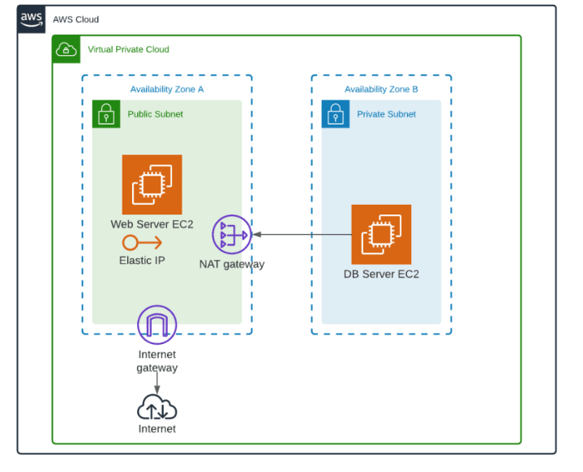
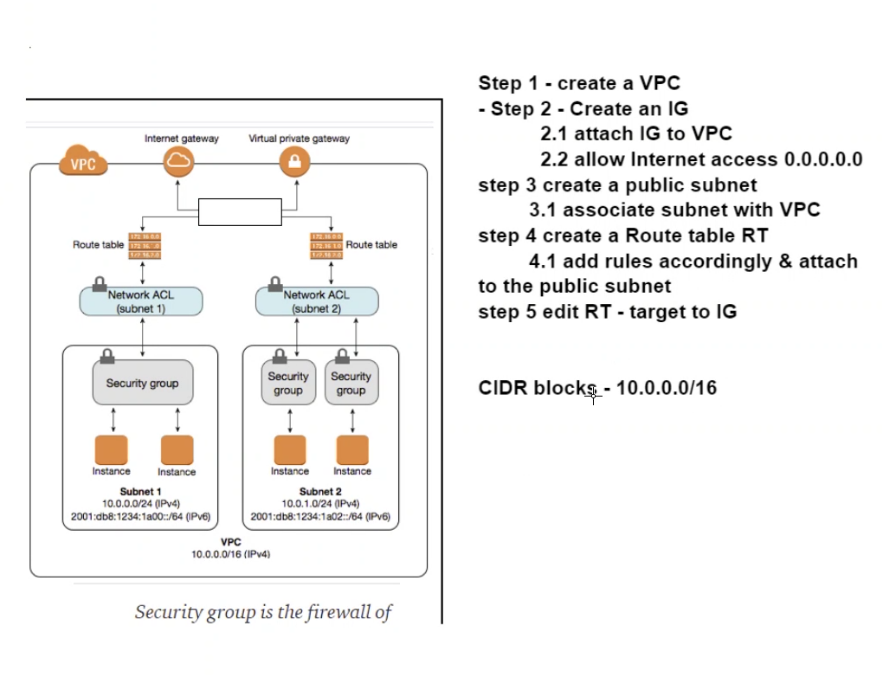
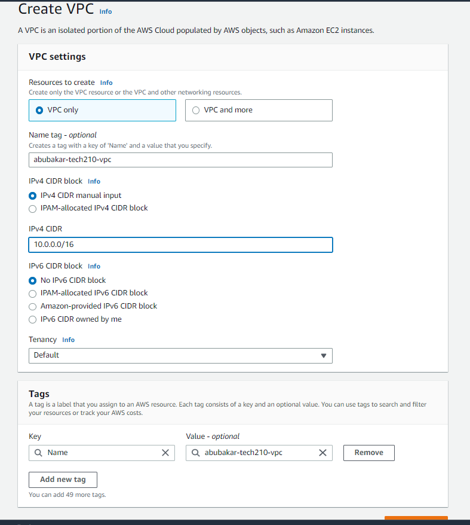
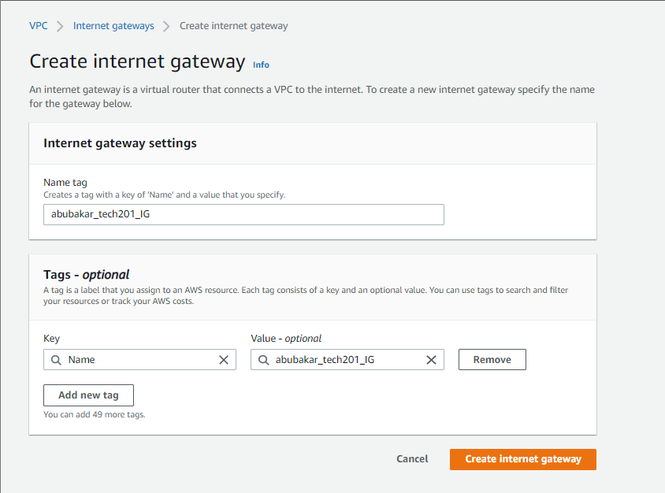
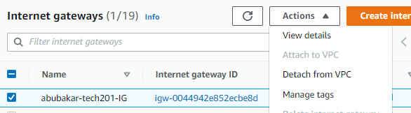
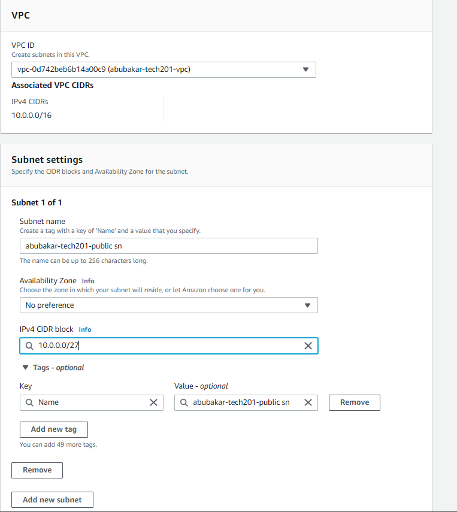
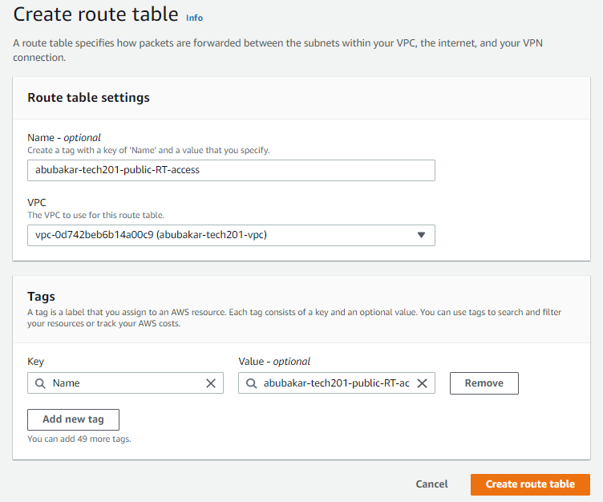
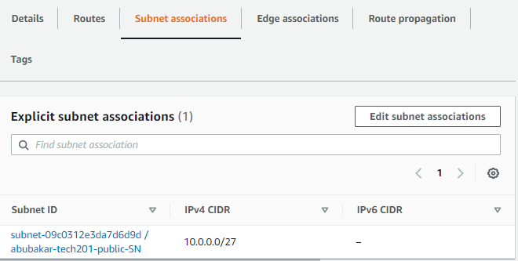
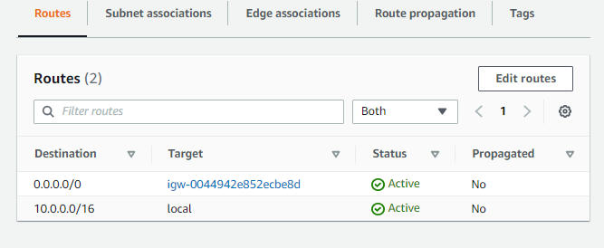

# VPC



## What are VPCs

VPCs, or Virtual Private Clouds, are a type of cloud computing network architecture that enables a business to create a private virtual network in the cloud. This virtual network operates as if it were a physical network, with its own IP address range, subnets, routing tables, and network gateways.

## How do they help a business 

VPCs can be helpful for businesses in several ways. First, they provide a more secure and isolated environment for computing resources than using a public cloud. With a VPC, a business can create a private network that is completely isolated from the public internet, which reduces the risk of security breaches and data leaks.

Additionally, VPCs provide greater control and flexibility over the network infrastructure. Businesses can create and manage their own subnets, route tables, and network gateways, allowing them to customize the network architecture to their specific needs. This can help improve network performance, reduce latency, and enable more efficient resource utilization.

## Benefits of VPC

Some benefits of using a VPC for a business include:

1. Security: A VPC provides a private, isolated environment for computing resources, reducing the risk of security breaches and data leaks.

2. Control and Flexibility: With a VPC, businesses have greater control over the network infrastructure and can customize it to their specific needs.

3. Cost-effectiveness: VPCs can help reduce costs by allowing businesses to more efficiently use computing resources and only pay for what they use.

4. Scalability: VPCs can be easily scaled up or down as needed, allowing businesses to quickly adapt to changing demand.

5. Hybrid Cloud Integration: VPCs can be integrated with on-premises infrastructure or other cloud services, enabling hybrid cloud deployments and more seamless data transfer.

## How does it help devops

VPCs can be very beneficial for DevOps teams as they provide a flexible and secure infrastructure that can support agile development and deployment practices. Here are some ways VPCs can help DevOps:

1. Isolated Testing and Staging Environments: DevOps teams can use VPCs to create isolated testing and staging environments that are separate from the production environment. This helps to reduce the risk of testing and development activities impacting the live production environment.

2. Customized Networking: VPCs allow DevOps teams to customize the network architecture to their specific needs. This can help improve network performance, reduce latency, and enable more efficient resource utilization.

3. Improved Security: VPCs provide a more secure environment for computing resources than using a public cloud. With a VPC, DevOps teams can create a private network that is completely isolated from the public internet, reducing the risk of security breaches and data leaks.

4. Automation and Scalability: DevOps teams can use automation tools to provision and manage VPC resources, which helps to reduce manual errors and improve scalability.

5. Integration with Other Cloud Services: VPCs can be integrated with other cloud services, enabling hybrid cloud deployments and more seamless data transfer. This can be especially helpful for DevOps teams that need to integrate multiple cloud services and on-premises infrastructure.

Overall, VPCs can provide DevOps teams with a secure, flexible, and scalable infrastructure that supports agile development and deployment practices.

## Why did AWS need to introduce VPC

AWS introduced VPCs to provide customers with a more secure and isolated environment for their computing resources. Prior to VPCs, AWS offered a public cloud infrastructure where all computing resources were exposed to the public internet. This made it difficult to create a private network environment that was completely isolated from the public internet.

Overall, AWS introduced VPCs to address the need for a more secure, isolated, and customizable network infrastructure for customers using its cloud computing services.

## What are subnets why do we use them and what are their benefits

A subnet is a range of IP addresses that are part of a larger network. Subnets are used to divide a network into smaller, more manageable segments, each with its own set of IP addresses. The primary benefits of using subnets include:

1. Improved Network Performance: By dividing a network into smaller subnets, network traffic can be better managed and optimized. This can help improve network performance and reduce latency.

2. Improved Security: Subnets can be used to create security boundaries within a network, helping to reduce the risk of security breaches and data leaks. For example, different subnets can be used for different groups of users or different types of applications, with different security policies applied to each.

3. Better Resource Utilization: Subnets can be used to optimize resource utilization by allowing different resources to be assigned to different subnets based on their specific needs. This can help reduce costs by enabling more efficient use of computing resources.

4. Greater Flexibility: Subnets can be customized to meet the specific needs of an organization, enabling greater flexibility in network architecture and resource management.

In addition to these benefits, subnets also help simplify network management by providing a logical way to organize and manage network resources. This can help reduce complexity and improve overall network reliability.

Overall, subnets are an important tool for managing network resources, improving network performance and security, and enabling greater flexibility in network architecture and resource management.

# Public and private subnets

Public subnets are subnets that are accessible from the public internet. They are typically used to host resources that need to be publicly accessible, such as web servers, load balancers, or other public-facing applications. Public subnets are assigned a public IP address, and their resources can be accessed from anywhere on the internet.

Private subnets, on the other hand, are subnets that are not accessible from the public internet. They are typically used to host resources that need to be kept private, such as databases, internal applications, or other sensitive resources. Private subnets are assigned a private IP address, and their resources can only be accessed from within the network or through a secure VPN connection.

## CIDR blocks

CIDR (Classless Inter-Domain Routing) blocks are a method for defining IP address ranges used in networking. CIDR blocks are used to allocate and manage IP address ranges in a more flexible and efficient manner than was possible with the older system of classful addressing.

CIDR blocks are defined by a combination of an IP address and a prefix length. The prefix length is expressed as the number of bits in the IP address that are used to define the network address, while the remaining bits are used to define the host address. For example, a CIDR block of 192.168.0.0/16 would define a network address of 192.168.0.0 with 16 bits used to define the network portion of the address.

The primary benefits of using CIDR blocks include:

1. Efficient IP Address Allocation: CIDR blocks allow IP addresses to be allocated more efficiently, by defining smaller address ranges that can be assigned to different networks or subnets as needed. This helps reduce IP address waste and ensures that IP addresses are used more efficiently.

2. Greater Flexibility: CIDR blocks provide greater flexibility in network architecture and resource management, allowing organizations to customize their network infrastructure to meet their specific needs.

3. Improved Network Performance: By defining smaller IP address ranges with CIDR blocks, network traffic can be better managed and optimized, improving network performance and reducing latency.

4. Simplified Network Management: CIDR blocks provide a logical way to organize and manage IP address ranges, simplifying network management and improving overall network reliability.

## Internet gateway

An internet gateway is a type of network gateway that allows traffic to flow between a VPC (Virtual Private Cloud) and the internet. Internet gateways are used to enable communication between resources in a VPC and the internet, as well as to provide access to other AWS services and resources outside the VPC.

Overall, internet gateways are an important tool for enabling communication between resources in a VPC and the internet, improving network connectivity, flexibility, security, and management.

## Rout table/s

A route table is a configuration object in Amazon Web Services (AWS) that is used to manage traffic routing within a VPC (Virtual Private Cloud). A route table contains a set of rules, or routes, that dictate how traffic should be directed between different subnets within the VPC and to destinations outside the VPC.

Overall, route tables are an important tool for managing traffic routing within a VPC, improving network performance, flexibility, security, and management. They allow for the efficient and secure routing of network traffic between resources within a VPC, as well as to destinations outside the VPC.

## NACL

These are on a subnet level, and the difference between an NACL and a security group is that you must specify on both inbound and outbound rules in a NACL but on security groups you just have to specify the inbound rules.

# Creating a virtual private cloud



The  first step is create our VPC, we only want a vpc and we will build and attach the rest of our vpc independently:



Next we need to create our internet gateway and attach it to our VPC:





The next step is to create our public subnet for ann app (make sure IPV4 CIDER block that you choose is not already in use) :



We now need to create a Rout Table:



Next edit the RT to allow traffic from the internet (You want to edit subnet association and select the right subnets)



The next step is to edit the routes and allow internet gateway (you want to select the one you created)



## Creating an app in our VPC

So when creating an EC2 instance we are going to:

- name appropriately
- use our app AMI
- select t2micro
- select our keypair
- pick our VPC we made
- create a new security group that will listen on port 22, 80, and 3000
- we can also input user data to speed up the apps launch 

If we add user data we will later have to ssh into our app and make sure to kill and restart the app
```
# check our processes
sudo lsof -i :3000
# kill the process
sudo kill -9 <PID>  # of process using port 3000

```
```
#!/bin/bash

sudo apt update -y 
sudo apt upgrade -y

cd /home/ubuntu/tech210_virtualisation/tech201_virtualisation/app # This is my specific path to my node.js file

nohup npm start 2>/dev/null 1>/dev/null&  # This code starts our application for us inside our user data
```

This will allow us to have an app in our new vpc.

# Creating a database in our vpc 

We want to :

- Begin by creating a new private subnet and allowing the ports we need :22 and 27017
- Create a route table for our private subnet
- Create  an ec2 for our database that is private (make a new security group)
- ssh into app
- Create env variable
```
export DB_HOST=mongodb://<ip address>:27017/posts
```
- Seed database and run app


